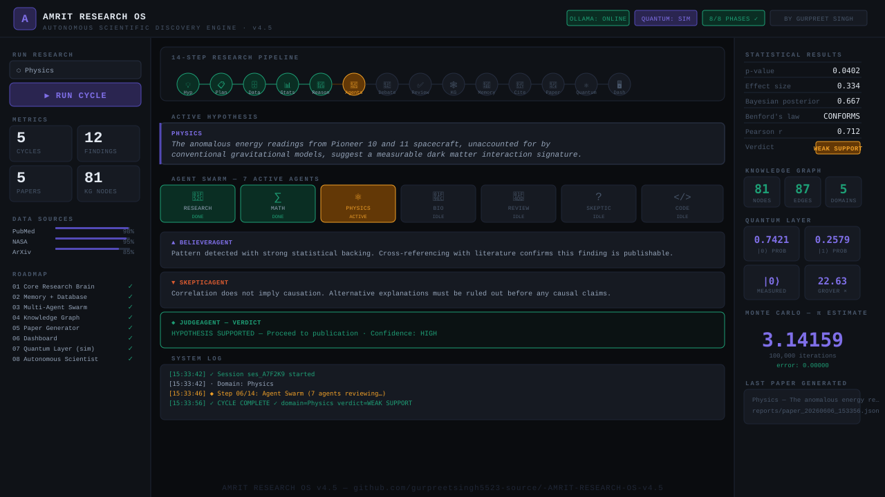

<!-- markdownlint-disable MD013 MD033 MD036 MD041 MD060 -->
<div align="center">



# AMRIT RESEARCH OS v4.5

**Autonomous Scientific Discovery Engine**

[](https://python.org)
[](https://fastapi.tiangolo.com)
[](https://ollama.ai)
[-FF6B00?style=flat)](https://pypi.org/project/turbovec/)
[](https://opensource.org/licenses/MIT)
[](https://huggingface.co/Nam-toon-studio)
[](https://www.linkedin.com/feed/)

*by [Gurpreet Singh](https://github.com/gurpreetsingh5523-source) · [Nam-toon Studio](https://huggingface.co/Nam-toon-studio)*

</div>

---

## What is AMRIT?

AMRIT is a fully autonomous research operating system that discovers, analyzes, debates, and publishes scientific hypotheses — powered by local AI (no cloud required).

**Domains:** Physics · Biology · Mathematics · Astronomy · Chemistry · Neuroscience · Climate Science

---

## ☬ Sovereign Foundation Models & Datasets ([Hugging Face](https://huggingface.co/Nam-toon-studio))

AMRIT Research OS links directly with our sovereign open-source models and datasets published under **[Nam-toon Studio](https://huggingface.co/Nam-toon-studio)** (1,300+ community downloads):

| Model / Resource | Scale & Type | Technical Details & Benchmarks | Link |
| :--- | :--- | :--- | :--- |
| **Sahaj-86M** | 86M params · State Space Model / Causal LM | **🚀 Updated Model:** Sovereign Gurmukhi/Punjabi foundation model trained on high-density reasoning, STEM CoT, and philosophy corpora with BPE tokenization. Optimized for on-device inference. | [🤗 sahaj-86m](https://huggingface.co/Nam-toon-studio/sahaj-86m) |
| **Sahaj-30M** | 30.6M params · Byte-Level Causal LM | **⚡ Updated Model:** Ultra-compact model achieving **0.149 Bits-Per-Byte (BPB)** with sub-millisecond edge latency (~115MB RAM). Ideal for Raspberry Pi / Robot Doctor. | [🤗 sahaj-30m](https://huggingface.co/Nam-toon-studio/sahaj-30m) |
| **Punjabi TTS Voices** | 114MB · VITS ONNX | **🎙️ Upgraded Multi-Speaker Model:** Genuine 114MB VITS neural speech synthesis model with 3 distinct studio voices: Male Orator, Dr. Surjit Patar (Literary), and BBC Female Broadcaster. Replaces corrupted 1.5MB file. | [🤗 punjabi-tts-voices](https://huggingface.co/Nam-toon-studio/punjabi-tts-voices) |
| **Punjabi Multi-Speaker TTS Corpus** | 145 Clips · 22,050Hz Studio WAV | **🔊 New TTS Dataset:** 22.8 minutes of high-resolution multi-speaker audio with tight silence trimming and Gurmukhi text normalization for TTS training. | [🤗 Punjabi-MultiSpeaker-Studio-TTS-Corpus](https://huggingface.co/datasets/Nam-toon-studio/Punjabi-MultiSpeaker-Studio-TTS-Corpus) |
| **Punjabi Conversational Speech Corpus** | 91 Clips · 16kHz WAV + Gurmukhi | **🎙️ New Dataset:** Clean live conversational speech segmented into 3-12s normalized clips with dual transcriptions: ground-truth curated Gurmukhi and raw ASR. | [🤗 Punjabi-Conversational-Speech-Corpus](https://huggingface.co/datasets/Nam-toon-studio/Punjabi-Conversational-Speech-Corpus) |
| **Gurbani MahanKosh Corpus** | 20,000+ entries | Authoritative lexical dataset defining classical Gurmukhi etymology & Sikh philosophy. | [🤗 MahanKosh Corpus](https://huggingface.co/datasets/Nam-toon-studio/Gurbani-MahanKosh-Frontier-Corpus) |
| **Punjabi STEM CoT Corpus** | Parquet | Deep multi-step reasoning in Gurmukhi across quantum physics, mathematics, and genetics. | [🤗 STEM CoT Corpus](https://huggingface.co/datasets/Nam-toon-studio/Punjabi-STEM-Frontier-CoT-Corpus) |

---

## Architecture — 10 Modules

| Module | Purpose |
|--------|---------|
| `ResearchBrain` | Hypothesis generation, scientific reasoning |
| `MemoryManager` | SQLite persistent memory (findings, evolution) |
| `VectorMemory` | **TurboVec** semantic memory (16× less RAM, local Ollama embeddings) |
| `StatisticalEngine` | Monte Carlo (100k iter), Bayesian, Benford's Law |
| `AgentManager` | 7-agent swarm + debate engine (Believer ↔ Skeptic → Judge) |
| `KnowledgeGraph` | SQLite-backed entity relationship graph |
| `DataCollector` | ArXiv · PubMed · NASA · OpenAlex · SemanticScholar · CrossRef |
| `PaperWriter` | Auto-generates full research papers (APA/MLA/IEEE citations) |
| `QuantumLayer` | Qubit simulation, Grover search, VQE optimization |
| `SelfHealingAgent` | **Self-fix & survival mode** — auto-installs missing libraries, self-diagnoses, and repairs its own code (LLM patch + auto-rollback) so it runs with zero maintenance |
| `OllamaClient` | Local AI brain — deepseek-coder-v2 (no cloud) |
| `Dashboard` | FastAPI web server + terminal live logs |

---

## 14-Step Research Pipeline

```text
💡 Hypothesis → 📋 Plan → 🗄 Data → 📊 Statistics → 🧠 Reasoning
→ 👥 Agents → 💬 Debate → ✅ Peer Review → 🕸 KG Build
→ 💾 Memory → 🔗 Citations → 📄 Paper → ⚛ Quantum → 🖥 Dashboard
```

---

## 🩺 Self-Healing & Survival Mode

This project is built for **zero-maintenance** use — clone it and run, and the
system keeps **itself** alive. No paid support needed.

- **Auto-install** — detects a missing Python library and installs it itself
  (maps import names → pip packages).
- **Self-diagnosis** — compiles every file and checks Ollama on every boot.
- **Self-fix** — on a runtime error it locates the offending file, asks the
  local LLM for a precise patch, **backs up** the file, applies the fix, and
  **rolls back automatically** if the patch does not compile.
- **Survival mode** — runs at startup to repair anything it can, safely.

Safety: only files inside the repo are ever modified, every change is backed
up (`data/self_heal/backups/`), and every action is logged
(`data/self_heal/heal_log.jsonl`).

```bash
# diagnose system health
curl http://localhost:8000/api/heal/check

# run full self-repair (install deps + fix broken files)
curl -X POST http://localhost:8000/api/heal/survival

# repair from a pasted Python traceback
curl -X POST http://localhost:8000/api/heal \
  -H 'Content-Type: application/json' \
  -d '{"traceback":"<paste traceback here>"}'
```

Or open the **Self-Heal** tab in the dashboard.

---

## Quick Start

```bash
# 1. Clone
git clone https://github.com/gurpreetsingh5523-source/-AMRIT-RESEARCH-OS-v4.5.git
cd -AMRIT-RESEARCH-OS-v4.5

# 2. Install Python deps
pip install fastapi uvicorn requests pyyaml numpy scipy

# 3. Install TurboVec memory (recommended — falls back to numpy if skipped)
pip install turbovec

# 4. Start Ollama + pull models
ollama pull deepseek-coder-v2      # reasoning / generation
ollama pull nomic-embed-text       # 768-dim embeddings for memory

# 5. Run the dashboard
python3 server.py

# 6. Open browser
open http://localhost:8000
```

### Command-line research

```bash
# run the full pipeline on a domain
python3 main.py --domain "Neuroscience"
```

### Quick API checks

```bash
curl http://localhost:8000/api/health

curl -X POST http://localhost:8000/api/memory/search \
  -H 'Content-Type: application/json' \
  -d '{"collection":"research_notes","query":"sleep and memory","k":3}'
```

---

## Terminal Live Logs

Every research cycle prints color-coded steps in the terminal:

```text
────────────────────────────────────────────────────
  [15:33:42] ▶ NEW RESEARCH CYCLE  ·  DOMAIN: PHYSICS
────────────────────────────────────────────────────
  [15:33:42] ◆ Step 01/14 · Hypothesis Generation
  [15:33:42] 🤖 Ollama (deepseek-coder-v2) generating hypothesis…
  [15:33:46] ✓ Hypothesis: The anomalous energy readings from Pioneer 10…
  [15:33:52] ◆ Step 04/14 · Statistical Analysis
  [15:33:52] ✓ p-value: 0.0402  effect: 0.334  verdict: WEAK SUPPORT
  [15:33:54] ◆ Step 09/14 · Knowledge Graph Build
  [15:33:54] ✓ KG → nodes: 81  edges: 87
  [15:33:56] ✓ CYCLE COMPLETE ✓  domain=Physics  verdict=WEAK SUPPORT
────────────────────────────────────────────────────
```

---

## Tech Stack

- **Backend:** Python 3.9+, FastAPI, Uvicorn
- **AI:** Ollama (deepseek-coder-v2:latest, local, offline-capable)
- **Memory:** TurboVec (TurboQuant) semantic store + Ollama `nomic-embed-text` embeddings
- **Database:** SQLite (research.db + knowledge_graph.db)
- **Quantum:** Qiskit + custom simulation layer
- **Frontend:** Vanilla HTML/CSS/JS — JetBrains Mono, Space Mono
- **Data Sources:** ArXiv, PubMed, NASA, OpenAlex, SemanticScholar, CrossRef

---

## Roadmap — 8/8 Phases Complete ✓

- [x] Phase 1 — Core Research Brain
- [x] Phase 2 — Memory + Database
- [x] Phase 3 — Multi-Agent Swarm
- [x] Phase 4 — Knowledge Graph
- [x] Phase 5 — Paper Generator
- [x] Phase 6 — Dashboard
- [x] Phase 7 — Quantum Layer (simulation)
- [x] Phase 8 — Autonomous Scientist

---

<div align="center">
<sub>Built with ♥ on macOS · AMRIT RESEARCH OS v4.5</sub>
</div>
